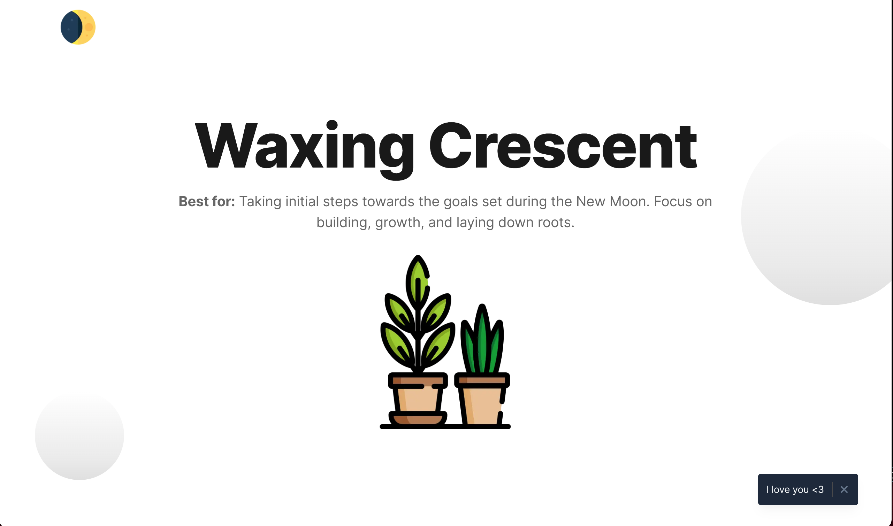

# Free Tailwind landing page template



Moon Ritual SPA is a single page for moon ritual info built on top of **TailwindCSS** and fully coded in **React** / **Next.js**. 

borrowed base template with ❤️ from [Cruip.com](https://cruip.com/).

*Original Version 1.3.3 built with Tailwind CSS and React + Vite is available [here](https://github.com/cruip/tailwind-landing-page-template/releases/tag/1.3.3).*

## TO DO when I have time (mostly optimizations)
- Optimize any images that are in this project based on screen size
- Setup unit testing components (just copy this implementation: https://github.com/vercel/next.js/tree/canary/examples/with-jest/__tests__)
- Rate limit and prevent DDOS somehow.. maybe only 20 refreshes (based on IP) before requiring sign in? API gateway is the solution.
- I should build this project every day at a certain time. This will let the app data be up to date but limit my api calls to RAPID API so one less thing to worry about. This is due to getStaticProps sets the value on build time and currently the automated build only runs when I push code up.


## API Used
- Moon Phase API (free if under 1000 calls per month)[Rapid API](ttps://rapidapi.com/MoonAPIcom/api/moon-phase/) 
## Design files

If you need the design files, you can download them from Figma's Community 👉 https://bit.ly/3HOZMpf

## Usage

This is a [Next.js](https://nextjs.org/) project bootstrapped with [`create-next-app`](https://github.com/vercel/next.js/tree/canary/packages/create-next-app).

### Getting Started

First, run the development server:

```bash
npm run dev
# or
yarn dev
# or
pnpm dev
```

Open [http://localhost:3000](http://localhost:3000) with your browser to see the result.

You can start editing the page by modifying `app/page.tsx`. The page auto-updates as you edit the file.

[API routes](https://nextjs.org/docs/api-routes/introduction) can be accessed on [http://localhost:3000/api/hello](http://localhost:3000/api/hello). This endpoint can be edited in `pages/api/hello.ts`.

The `pages/api` directory is mapped to `/api/*`. Files in this directory are treated as [API routes](https://nextjs.org/docs/api-routes/introduction) instead of React pages.

This project uses [`next/font`](https://nextjs.org/docs/basic-features/font-optimization) to automatically optimize and load Inter, a custom Google Font.

### Learn More

To learn more about Next.js, take a look at the following resources:

- [Next.js Documentation](https://nextjs.org/docs) - learn about Next.js features and API.
- [Learn Next.js](https://nextjs.org/learn) - an interactive Next.js tutorial.

You can check out [the Next.js GitHub repository](https://github.com/vercel/next.js/) - your feedback and contributions are welcome!

### Deploy on Vercel

The easiest way to deploy your Next.js app is to use the [Vercel Platform](https://vercel.com/new?utm_medium=default-template&filter=next.js&utm_source=create-next-app&utm_campaign=create-next-app-readme) from the creators of Next.js.

Check out our [Next.js deployment documentation](https://nextjs.org/docs/deployment) for more details.


### Support notes
This template has been developed with the App Router (`app`) and React Server Components. If you’re unfamiliar with these beta features, you can find more information about them on the Next.js beta documentation page. So, please note that any request dealing with React (e.g. extra features, customisations, et cetera) is to be considered out of the support scope.

For more information about what support covers, please see our (FAQs)[https://cruip.com/faq/].

## Credits

- [Nucleo](https://nucleoapp.com/)

## Terms and License

- Released under the [GPL](https://www.gnu.org/licenses/gpl-3.0.html).
- Copyright 2020 [Cruip](https://cruip.com/).
- Use it for personal and commercial projects, but please don’t republish, redistribute, or resell the template.
- Attribution is not required, although it is really appreciated.

## About Us

We're an Italian developer/designer duo creating high-quality design/code resources for developers, makers, and startups.

## Stay in the loop

If you would like to know when we release new resources, you can follow us on [Twitter](https://twitter.com/Cruip_com), or you can subscribe to our monthly [newsletter](https://cruip.com/#subscribe).


### NOTES
I like aws serverless so backend api will be simple lambda behind api gateway with cloudfront for caching

https://aws.amazon.com/blogs/compute/protecting-an-aws-lambda-function-url-with-amazon-cloudfront-and-lambdaedge/#:~:text=In%20this%20example%2C%20using%20CloudFront,the%20users%3A%20Lambda%40Edge.

